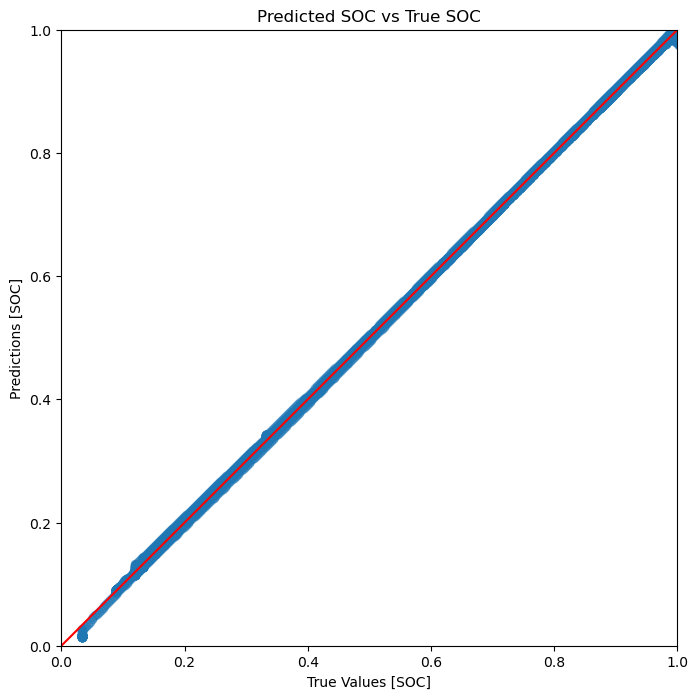
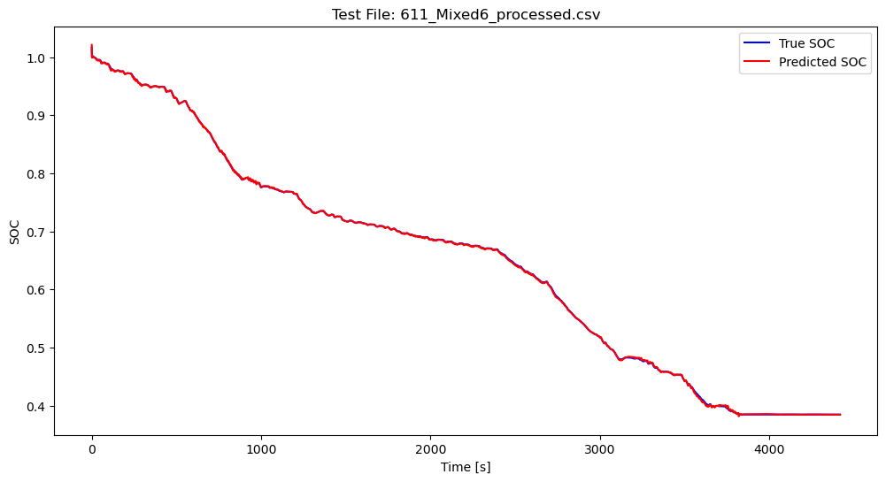
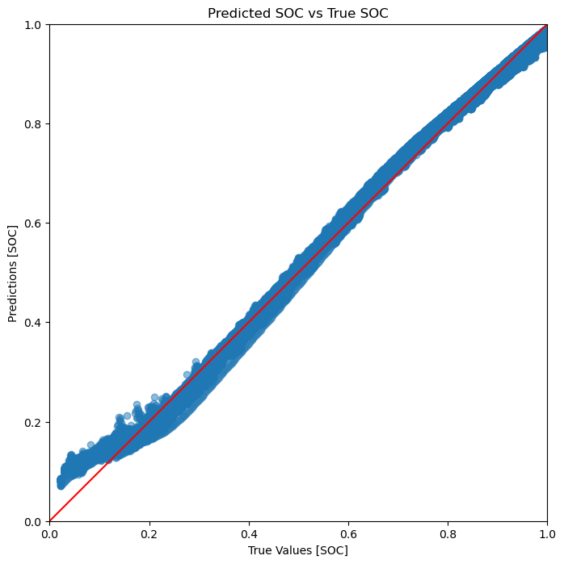
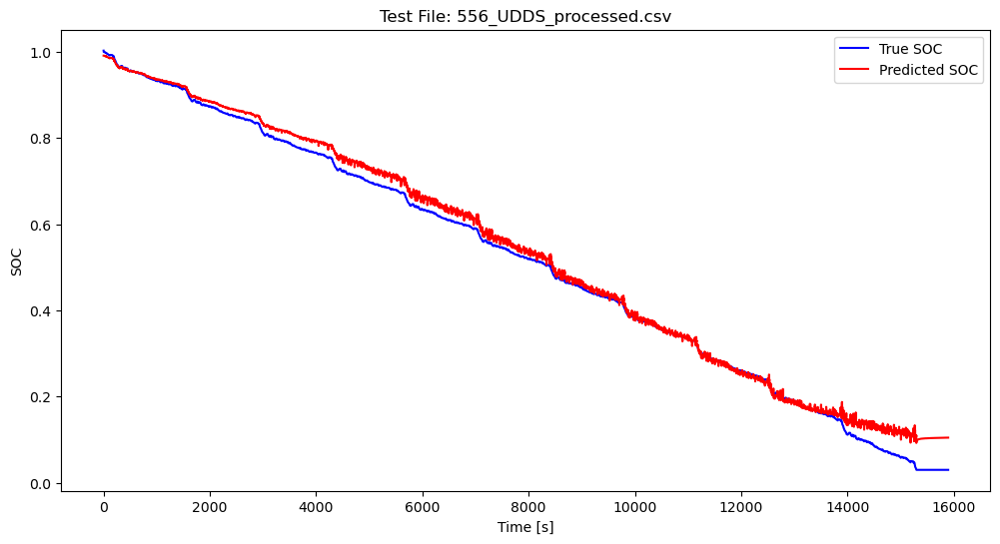
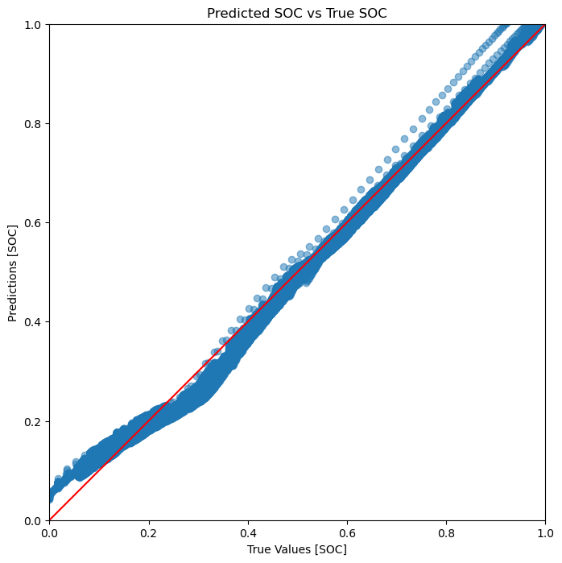
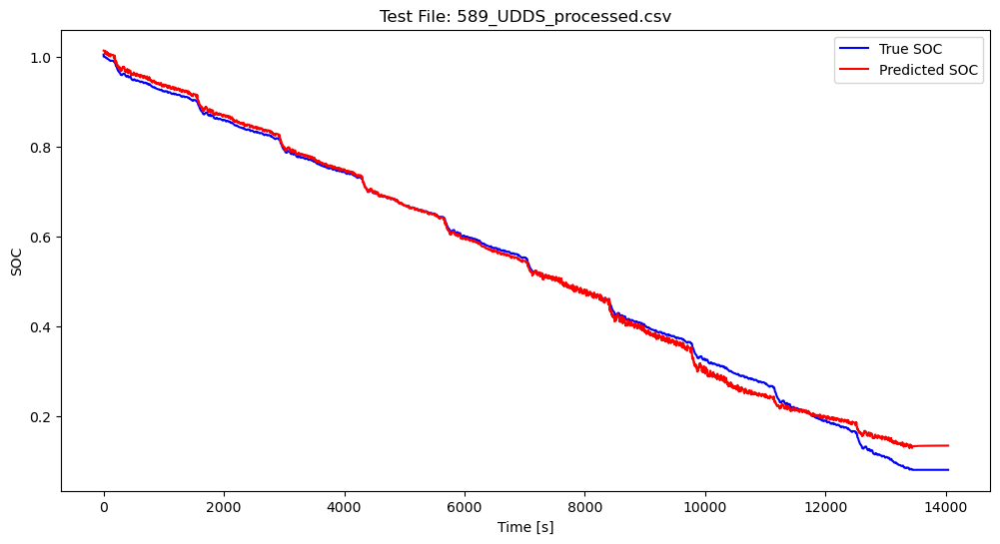

# Battery State of Charge Estimation Project

## Introduction
This project focuses on estimating the State of Charge (SoC) for lithium-ion batteries, specifically the LG HG2 model, using advanced machine learning techniques. By implementing and comparing Fully Connected Network (FCN), Convolutional Neural Network (CNN) and Long Short-Term Memory (LSTM) networks, the project aims to provide accurate and reliable SoC predictions that are essential for efficient battery management systems.

## Dataset
The data utilized in this project comes from the following source and is publicly available: 
[LG 18650HG2 Li-ion Battery Data - Mendeley Data](https://data.mendeley.com/datasets/cp3473x7xv/3)

Citation:  
Kollmeyer, Philip; Vidal, Carlos; Naguib, Mina; Skells, Michael (2020), “LG 18650HG2 Li-ion Battery Data and Example Deep Neural Network xEV SOC Estimator Script”, Mendeley Data, V3, doi: 10.17632/cp3473x7xv.3

## Features
The primary features of this repository include:

- **Data Preprocessing**: Implementation of data cleaning, normalization, and transformation scripts to prepare the dataset for modeling.
- **Model Development**: Scripts and notebooks for building and training FCN, CNN, and LSTM models.
- **Hyperparameter Optimization**: Utilization of Optuna for systematic hyperparameter tuning to enhance model performance.
- **Performance Evaluation**: Tools for quantitative model assessment using standard metrics such as MSE and MAE.
- **Results Visualization**: Scripts for visualizing predictions versus true values to evaluate model predictions qualitatively.
- **Model Application**: Demonstration of model deployment on specific test cases to predict SoC.

## Project Structure

### Dataset
The `dataset` directory is meticulously structured to streamline the data processing workflow. It includes several subdirectories, each designated for specific stages in the data transformation pipeline:

- **`LG_HG2_data`**: This subdirectory houses the raw experimental data files. These files contain the initial, unprocessed battery data, serving as the starting point for all subsequent data processing steps.

- **`LG_HG_HG2_parsed`**: After the initial parsing of raw data, the formatted files are stored here. The parsing process standardizes the data structure, making it suitable for more detailed processing and analysis.

- **`LG_HG2_processed`**: This subdirectory contains data files that have undergone the complete processing cycle. It includes SOC estimation, data filtering for 1 Hz sampling, and any other transformations required to prepare the data for model training and analysis.

- **`LG_HG2_parsed_plots`**: Dedicated to storing plots generated from the parsed data, this subdirectory facilitates visual inspection and preliminary analysis of the data in its early processing stage.

- **`LG_HG2_processed_plots`**: Here, you'll find plots generated from the fully processed data. These plots include visual representations of SOC and other key metrics, crucial for a deeper understanding and evaluation of the processed data.

- **Log File (`processing_log.log`)**: An essential aspect of the data processing workflow, this log file meticulously records each step taken during the data transformation process. It includes entries for any issues encountered, which aids in debugging and ensures transparency and reproducibility of the processing pipeline.

### Data Processing
The `data_processing` directory is structured to manage all essential preprocessing steps for the modeling and evaluation workflow in battery data analysis. It includes scripts for parsing, processing, visualizing, and preparing the data for subsequent machine learning applications.

#### `data_parsing.py`
The `data_parsing.py` script is a comprehensive tool designed to transform raw battery data into a structured and analyzable format. Its functionalities include:

- **Parsing Raw Data**: Reads raw CSV files and converts them into structured Pandas DataFrames. This includes transforming time data from minutes to seconds, allowing for precise temporal analysis.

- **Interpolating SOC Values**: Employs pseudo Open Circuit Voltage (OCV) methods to estimate the State of Charge (SOC), distinguishing between charging and discharging phases. This is critical for accurately modeling the battery's behavior under different operational conditions.

- **Coulomb Counting for SOC Estimation**: Implements Coulomb counting techniques for enhanced SOC estimation, providing a more accurate account of the battery's charge and discharge cycles.

- **Generating Plots for Analysis**: Produces detailed plots of voltage, current, temperature, capacity, and SOC. These plots are stored in separate directories for both parsed and processed data, aiding in easy visualization and comparative analysis.

- **Efficient Data Handling with Multiprocessing**: Utilizes multiprocessing to optimize the processing of large datasets, significantly improving efficiency and speed, especially when dealing with large volumes of battery data.

- **Comprehensive Logging**: Integrates detailed logging to document the data processing steps and results. This aids in process tracking, troubleshooting, and ensuring the reproducibility of the analysis.

- **1 Hz Sampling in Processed Data**: Includes functionality to round time data to achieve a 1 Hz sampling rate in processed data, ensuring uniformity and suitability for high-frequency analysis.

The script uses multiprocessing to enhance the efficiency of processing multiple data files, which is particularly beneficial when working with extensive datasets.

### Modeling and Evaluation

The `modeling_and_evaluation` directory encompasses the entire workflow from training the models to evaluating their performance. This directory is the core of the repository, containing all scripts and notebooks related to model training, evaluation, and visualization.

#### Training Scripts
- **FCN, CNN, and LSTM Models**: Detailed instructions and code for training neural network models.
- **Optuna Integration**: Hyperparameter tuning with Optuna to find the optimal model configurations and sensitivity of each hyperparameter.

#### Evaluation Metrics
- Within this directory, you will also find scripts designed to assess the model's accuracy. These scripts will help you calculate key performance indicators such as Mean Squared Error (MSE) and Mean Absolute Error (MAE).

#### Visualization Tools
- To aid in the interpretation of the models' performance, visualization tools are provided. These tools allow for the plotting of predicted SoC values against the actual values from the test datasets, offering a visual representation of the model's predictions compared to the true data points.

#### Test Predictions
- Also included are examples that showcase the application of the trained models to specific test datasets. These examples demonstrate how the models can be used to predict SoC in real-world scenarios and highlight their predictive capabilities on unseen data.

The consolidation of these scripts into one directory streamlines the process from model training to evaluation, providing a cohesive and intuitive user experience.

## Results

The models have been trained and evaluated from negative 20 deg C to 40 deg C except charge pulse dataset, with the following key results:
- FCN Model MSE: 0.1741 %, MAE: 3.6369 %
- CNN Model MSE: 0.1548 %, MAE: 3.2833 %
- LSTM Model MSE: 8.7771e-04 %, MAE: 0.1884 %
- The LSTM model outperformed the FCN and CNN in capturing temporal dependencies, achieving an even lower MSE of 8.7771e-04 % on the test data. Here in the LSTM Model, with 1 Hz processed, data 20 data points were selected as sequence lengths to capture temporal behaviour. 
- Visualization of predictions against true values indicates excellent model alignment with real-world data.

  
   

<figcaption>
  
<em>Figure 1: Scatter plot illustrating the relationship between predicted and true SoC values by the LSTM model (left).</em>

  
<em>Figure 2: Predicted and true SoC values on a test data by the LSTM model (right).</em>

</figcaption>

  
  

<figcaption>
  
<em>Figure 3: Scatter plot illustrating the relationship between predicted and true SoC values by the CNN model (left).</em>

  
<em>Figure 4: Predicted and true SoC values on a test data by the CNN model (right).</em>

</figcaption>

  
  

<figcaption>
  
<em>Figure 3: Scatter plot illustrating the relationship between predicted and true SoC values by the FCN model (left).</em>

  
<em>Figure 4: Predicted and true SoC values on a test data by the FCN model (right).</em>

</figcaption>

### Issues with Sigmoid Activation in SOC Prediction

#### Background
The sigmoid activation function is traditionally used in binary classification tasks because it maps input values to an output range between 0 and 1. This characteristic makes it well-suited for representing probabilities in binary outcomes.

  

<figcaption>
  
<em>Figure 5: Scatter plot illustrating the relationship between predicted and true SoC values by the FCN model using sigmoid activation at the output layer.</em>

</figcaption>

#### Identified Issues
In the context of predicting SOC with FCN, which is a regression task with a continuous range of possible output values, the sigmoid function at the output layer imposed constraints that affected the model's predictive performance:

1. **Limited Output Range**: The sigmoid function constrained the model's output to the (0,1) range. This limitation was problematic because SOC values, while normalized, could have a broader range in practical scenarios, leading to inaccurate predictions, especially at the extremes.

2. **Gradient Saturation**: During backpropagation, the gradient of the sigmoid function can become extremely small, nearly zero, for inputs that are far from zero. This gradient saturation, often referred to as the vanishing gradient problem, can significantly slow down the learning process or lead to convergence at suboptimal weights.

3. **Non-Zero Centered**: The sigmoid function is not zero-centered, which means that the outputs of the neurons in the network using sigmoid activation will always be positive. This can introduce undesirable dynamics in the gradient flow through the network.

#### Resolution
To address these issues, we modified the output layer by removing the sigmoid activation function. This change allowed the network to predict continuous values and improved the model's ability to learn and generalize from the data.

## Getting Started
To get started with the Battery State of Charge Estimation Project, follow these steps:

1. Clone the repository to your local machine.
2. Navigate to the project directory.
3. Install the required dependencies listed in `requirements.txt`.
4. Follow the instructions in the `/modeling_and_evaluation` directory to train and evaluate the models.

For more detailed instructions, please refer to the README files within each subdirectory.

## Author
- **Arpan Biswas**

## License
This project is open-sourced under the MIT License. See the [LICENSE](LICENSE) file for details.
